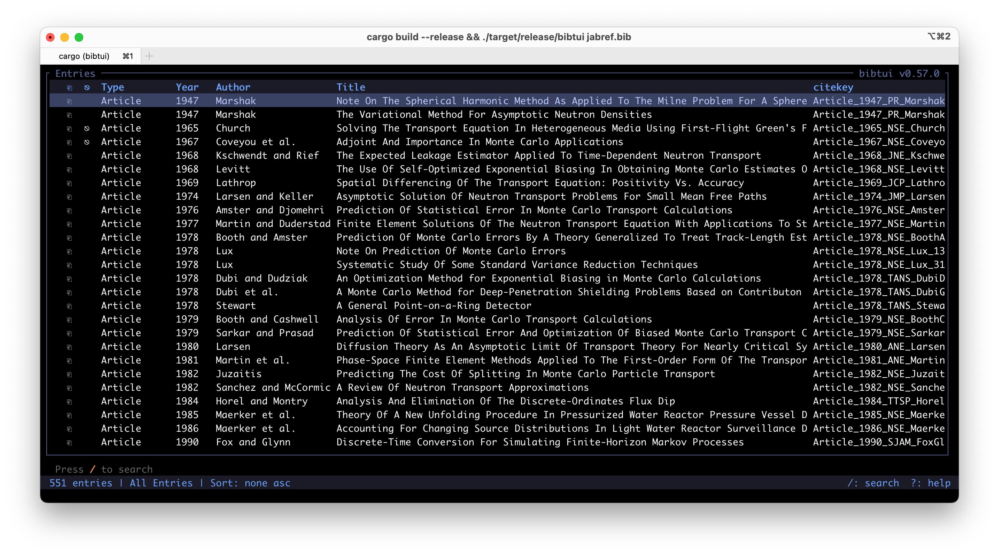

# bibtui

[](https://github.com/jkulesza/bibtui/actions/workflows/ci.yml)
[](https://codecov.io/gh/jkulesza/bibtui)

A terminal UI BibTeX manager written in Rust. Designed as a lightweight, keyboard-driven replacement for JabRef.



## Features

- Fast fuzzy search across all fields with field-specific syntax (`author:smith year:2020`)
- JabRef-compatible group tree (static and keyword groups)
- Byte-perfect BibTeX round-tripping — formatting is preserved for unmodified entries; on save, fields are alphabetized within required / optional / nonstandard subgroups for consistent ordering
- Vim-style navigation throughout
- Entry CRUD: add, edit, duplicate, delete with undo (`u`)
- JabRef-compatible citation key patterns with three-level precedence (`.bib` metadata, YAML config, defaults)
- Clipboard yank (`yy`) in configurable format: citation key, raw BibTeX, or formatted citation
- Per-entry status indicators: `●` unsaved change, `⎘` file attachment, `⎋` DOI/URL
- Open attached files (`o`) or DOI/URL links (`w`) with OS default applications
- Citation preview popup (`Space`) with DOI/URL link, formatted in IEEEtranN style
- LaTeX markup rendered to Unicode for display (`L` to toggle)
- Assigned groups shown in the entry detail header alongside the entry type
- ISO 4 journal abbreviation: the Journal column always shows the abbreviated form; a save action syncs `journal_full` and `journal_abbrev` companion fields
- Configurable columns, sort, theme, citekey templates, and **keybinding overrides** via YAML
- Export entries to **CSL-JSON** (Zotero/Pandoc compatible) or **RIS** via `:export-json` / `:export-ris`
- In-TUI settings editor (`S`) with live config import/export, `Tab`-completion path dialogs, and field group management
- Validate command (`v`) dry-runs all save actions and shows which fields would change, without modifying the file
- Context-sensitive help modal (`?`): entry-list view shows navigation, search, command-palette, and **Quality** (C / M / v) keys in dedicated sections; detail view shows field editing and vim modal editor keys
- `F` in the detail view syncs the attached filename to the current citation key on demand, with undo support
- Scrollable filename-sync preview dialog confirms file renames before they are applied
- Import entries from a DOI, URL, or local PDF file (`I` or `:import <doi-or-url-or-path>`): queries Crossref for metadata, with extensible publisher-specific scrapers (ANS, Taylor & Francis); automatically downloads an open-access PDF via Unpaywall when available; extracts DOI from local PDFs and sets the file attachment directly; citation key is generated immediately from the configured template
- Import books by ISBN-10 or ISBN-13 (`I` or `:import <isbn>`): fetches metadata from OpenLibrary; accepts any common notation (bare digits, hyphens, spaces, mixed); stores ISBN-13 when available, falls back to ISBN-10
- Per-file attachment management in the detail view: each attached file appears as its own navigable row; `e`/`Enter` edits the path, `f` adds a new attachment, `d` removes an individual file
- URL fields preserve percent-encoding (e.g. `%20`) on save
- `w` fetches DOI/URL from Crossref via metadata (title, author, year) when none is present, in both the entry list and detail view; only sets `url` when it is distinct from the DOI; when multiple links are available (DOI, URL, ISBN) a picker dialog is shown
- `w` opens an OpenLibrary search (`openlibrary.org/search?isbn=…`) for entries with an `isbn` field but no DOI or URL
- HTTPS requests (DOI/URL fetch, Crossref, Unpaywall) use rustls by default with native TLS available so corporate VPN certificate authorities are trusted automatically
- Import errors are shown in a full-screen popup so long messages (e.g. network errors) are never truncated; `yy` copies the error text to the clipboard

## Requirements

- Rust toolchain (stable, 1.70+): https://rustup.rs

## Build

```sh
cargo build --release
```

The binary is placed at `target/release/bibtui`.

Optionally copy it to somewhere on your `$PATH`:

```sh
cp target/release/bibtui ~/.local/bin/
```

Pre-built binaries for Linux (static musl and RPM), macOS (Apple Silicon and Intel), and Windows are attached to each [GitHub release](https://github.com/jkulesza/bibtui/releases). macOS binaries are code-signed and notarized with an Apple Developer ID, so Gatekeeper will not block them.

**Linux RPM** (Fedora / RHEL / openSUSE):

```sh
sudo rpm -i bibtui-<version>-linux-x86_64.rpm
```

## Usage

```
bibtui [OPTIONS] [BIB_FILE]

Arguments:
  [BIB_FILE]  Path to .bib file

Options:
  -c, --config <CONFIG>  Path to config file
  -h, --help             Print help
  -V, --version          Print version
```

If no file is given on the command line, bibtui looks for `bib_file` in the config file.

```sh
bibtui references.bib
bibtui --config ~/dotfiles/bibtui.yaml references.bib
```

## Keyboard Reference

### Entry List (Normal mode)

| Key | Action |
|-----|--------|
| `j` / `↓` | Move down |
| `k` / `↑` | Move up |
| `gg` | Jump to top |
| `G` | Jump to bottom |
| `Ctrl-F` / `Ctrl-B` | Page down / up |
| `Enter` | Open entry detail (list focus) / select group (sidebar focus) |
| `a` | Add new entry |
| `dd` | Delete selected entry |
| `D` | Duplicate selected entry |
| `yy` | Yank to clipboard (see `general.yank_format`) |
| `/` | Start fuzzy search |
| `h` / `←` | Focus group sidebar (reveals it if hidden) |
| `l` / `→` | Focus entry list |
| `Tab` | Toggle group sidebar |
| `Space` | Citation preview popup (list focus) / select group (sidebar focus) |
| `o` | Open attached file(s) in OS default viewer |
| `w` | Open DOI / URL in default browser |
| `B` | Toggle case-protecting brace display |
| `L` | Toggle LaTeX rendering (accents, math, dashes) |
| `v` | Validate: dry-run save actions, show what would change |
| `I` | Import entry from DOI, URL, ISBN, or local PDF file |
| `S` | Open settings editor |
| `u` | Undo last change |
| `:` | Open command palette |
| `?` | Show full-screen help modal |
| `Esc` | Clear active search filter (if any); otherwise reset sort to configured default |

### Search mode

| Key | Action |
|-----|--------|
| Type | Append to search query |
| `Enter` | Confirm search / lock results |
| `Esc` | Clear search and exit |

Search syntax:
- Plain text — fuzzy match across all fields
- `field:query` — restrict to a specific field, e.g. `author:smith`, `year:2024`, `title:neural`

### Entry Detail view

The detail header shows the entry type and its currently assigned groups.

| Key | Action |
|-----|--------|
| `j` / `k` | Move field selection |
| `gg` | Jump to first field |
| `G` | Jump to last field |
| `Ctrl-F` / `Ctrl-B` | Page down / up |
| `e` / `i` / `Enter` | Edit selected field (vim-style: `i` enters insert mode) |
| `A` | Add new field |
| `f` | Add file attachment |
| `F` | Sync attached filename(s) to current citation key (undoable) |
| `d` | Delete selected field |
| `T` | Convert selected field to title case |
| `a` | Normalize person-name fields (`author`, `editor`, etc.) to "Last, First" form |
| `o` | Open attached file(s) in OS default viewer |
| `w` | Open DOI / URL in default browser; if none exists, fetches DOI from metadata via Crossref |
| `Tab` | Edit entry's group assignments |
| `c` | Regenerate citation key from template |
| `B` | Toggle case-protecting brace display |
| `L` | Toggle LaTeX rendering |
| `u` | Undo last change |
| `/` | Start incremental field search |
| `n` / `N` | Jump to next / previous search match |
| `Esc` | Clear active search (first press); close detail (second press) |

### Field editor (Editing mode)

The field editor uses vim-style modal editing. Opening a non-empty field starts in **Normal mode**; opening an empty field starts directly in **Insert mode**. The title bar shows `— INSERT` or `— REPLACE` when in those modes. Empty `title` / `booktitle` fields are pre-filled with `{}` and the cursor is placed inside the braces so case-protection is applied automatically.

#### Normal mode

| Key | Action |
|-----|--------|
| `i` | Enter Insert mode at cursor |
| `a` | Enter Insert mode after cursor |
| `A` | Enter Insert mode at end of line |
| `I` | Enter Insert mode at start of line |
| `R` | Enter Replace mode (overwrites characters; Backspace undoes one char at a time) |
| `h` / `←` | Move cursor left |
| `l` / `→` | Move cursor right |
| `0` / `Home` | Jump to start |
| `$` / `End` | Jump to end |
| `w` / `W` | Move to start of next word / WORD |
| `b` / `B` | Move to start of current/previous word / WORD |
| `e` / `E` | Move to end of current/next word / WORD |
| `f{c}` | Find next occurrence of character `c` (cursor lands on `c`) |
| `F{c}` | Find previous occurrence of character `c` (cursor lands on `c`) |
| `t{c}` | Move cursor to char just before next occurrence of `c` |
| `T{c}` | Move cursor to char just after previous occurrence of `c` |
| `j` / `↓` | Save edit and move to next field |
| `k` / `↑` | Save edit and move to previous field |
| `x` | Delete character under cursor |
| `X` | Delete character before cursor |
| `dw` | Delete to start of next word |
| `dt{c}` | Delete from cursor to (not including) next `c` |
| `df{c}` | Delete from cursor through (including) next `c` |
| `dT{c}` | Delete from (not including) previous `c` back to cursor |
| `dF{c}` | Delete from (including) previous `c` back to cursor |
| `D` | Delete to end of line |
| `C` | Change to end of line (delete + enter Insert mode) |
| `s` | Substitute character (delete + enter Insert mode) |
| `S` | Substitute entire field (clear + enter Insert mode) |
| `r{c}` | Replace character under cursor with `c` |
| `~` | Toggle case of character under cursor |
| `p` | Put (paste) from unnamed register after cursor |
| `yy` | Yank entire field value to unnamed register and system clipboard |
| `u` | Undo last change |
| `Enter` | Confirm edit |
| `Esc` | Cancel edit |

#### Insert mode

| Key | Action |
|-----|--------|
| Type | Insert character |
| `←` / `→` | Move cursor |
| `Ctrl-A` / `Home` | Jump to start |
| `Ctrl-E` / `End` | Jump to end |
| `Backspace` / `Delete` | Delete character |
| `Ctrl-W` | Delete word before cursor |
| `Ctrl-U` | Delete to start of line |
| `Tab` / `Shift-Tab` | Cycle forward / backward through completions |
| `Enter` | Confirm edit |
| `Esc` | Return to Normal mode |

Operations that delete text (`x`, `dw`, `dt{c}`, `df{c}`, `dT{c}`, `dF{c}`, `D`, `s`, `S`, `Ctrl-W`, `Ctrl-U`) save the deleted text to the unnamed register so it can be restored with `p`. Entering Insert mode via `i`/`a`/`A`/`I` snapshots the field value for undo with `u`. In Replace mode (`R`) each overwritten character is individually reversible with `Backspace`.

Long values scroll horizontally; `<` and `>` at the edges indicate hidden text.  The cursor is kept near the visual midpoint: it moves freely between the nearest edge and the centre, then the text scrolls while the cursor stays fixed at the centre.

**Month field selector:** editing a `month` field shows a visual 2×6 grid of the
standard BibTeX abbreviations (`jan`–`dec`). Use `←`/`→` to step one month,
`↑`/`↓` to jump between rows, or type a prefix (with ghost-text autocomplete) and
press `Tab` to cycle through matches. Any recognized form (`january`, `1`, `Jan`, etc.)
is normalized to the three-letter abbreviation on save.

Path dialogs (settings export/import, import entry, and export dialogs) support `Tab`
completion: the first press fills the longest common prefix of all matches; subsequent
presses cycle through candidates. Leading `~` is expanded to the home directory.

### Settings editor (`S`)

Opens a full-screen view of all configuration options. Changes apply immediately to the running session.

| Key | Action |
|-----|--------|
| `j` / `k` | Navigate settings |
| `g` / `G` | Jump to top / bottom |
| `Ctrl-F` / `Ctrl-B` | Page down / up |
| `Enter` / `Space` | Toggle boolean setting |
| `e` | Edit string setting / edit fields of selected field group |
| `r` | Rename selected field group |
| `a` | Add new field group |
| `x` | Delete selected field group |
| `E` | Export current config to a YAML file (path dialog with `Tab` completion) |
| `I` | Import config from a YAML file (path dialog with `Tab` completion) |
| `Esc` | Close settings |

Settings marked with `●` differ from their default value.

### Command palette

Open with `:` from the entry list.

| Command | Description |
|---------|-------------|
| `:w` / `:write` / `:save` | Save the file |
| `:wq` | Save and quit |
| `:q` | Quit (warns if unsaved changes) |
| `:q!` | Force quit without saving |
| `:sort <field>` | Sort by field (repeat to toggle direction) |
| `:sort none` | Clear sort and restore file order |
| `:sort` | Toggle sort direction |
| `:group <name>` | Filter to a named group |
| `:search <query>` | Apply a search query |
| `:import <doi-or-url-or-path>` | Import entry from DOI, URL, or local PDF file |
| `:export-json [path]` | Export all entries as CSL-JSON (prompts for path if omitted) |
| `:export-ris [path]` | Export all entries as RIS (prompts for path if omitted) |

Example: `:sort year`, `:sort author`, `:sort title`, `:sort citation_key`, `:sort none`

When `save.sync_filenames` is enabled, saving with `:w` or `:wq` shows a scrollable
preview of any file renames that will be performed, with `[y]es` / `[n]o` to proceed
or cancel.

### Group tree

| Key | Action |
|-----|--------|
| `j` / `k` | Move selection |
| `Enter` / `Space` | Apply selected group filter |
| `h` / `l` | Switch focus between groups and entry list |

The group sidebar can be hidden with `Tab` and revealed again with `Tab` or `h` / `←`.
The `display.show_groups` config option controls whether it is visible on startup.

## Configuration

bibtui looks for a config file in this order:

1. Path given with `--config`
2. `./bibtui.yaml` or `./bibtui.yml` (next to the working directory)
3. `$XDG_CONFIG_HOME/bibtui/config.yaml` (typically `~/.config/bibtui/config.yaml`)

If no file is found, built-in defaults are used.

Copy the annotated example to get started:

```sh
cp bibtui.yaml.example ~/.config/bibtui/config.yaml
```

### Key config options

```yaml
general:
  bib_file: ~/documents/references.bib   # default file when none given on CLI
  backup_on_save: true                    # write .bib.bak before every save
  yank_format: prompt                     # citation_key | bibtex | formatted | prompt
                                          #   citation_key — bare key (e.g. Smith2020)
                                          #   bibtex       — raw @Article{...} block
                                          #   formatted    — IEEEtranN citation string
                                          #   prompt       — picker dialog each time

display:
  show_groups: true                       # show group sidebar on startup
  group_sidebar_width: 30
  show_braces: false                      # show/hide case-protecting {braces}; toggle with B
  render_latex: true                      # render LaTeX → Unicode for display; toggle with L
  abbreviate_authors: true                # abbreviate author lists in entry list
  journal_field_content: full             # what the journal field holds after the
                                          # abbreviate_journal save action:
                                          #   full        — full journal name
                                          #   abbreviated — ISO 4 abbreviation
                                          # (the Journal column always shows the
                                          #  abbreviated form regardless of this setting)
  default_sort:
    field: citation_key
    ascending: true

save:
  align_fields: true                      # align field values to a column on save
  field_order: alphabetical               # alphabetical (default) | jabref
                                          # alphabetical sorts within required / optional /
                                          # nonstandard subgroups on every save
  sync_filenames: false                   # rename attached files to match citation key on save
                                          # (preview dialog shown before applying)
  save_action_abbreviate_journal: false   # populate journal_abbrev (ISO 4) and journal_full
                                          # companion fields on save; rewrite journal per
                                          # journal_field_content (display/settings)

titlecase:
  ignore_words: [MCNP, OpenMC]           # words kept verbatim by the T title-case command

theme:
  selected_bg: "#3b4261"
  selected_fg: "#c0caf5"
  header_bg:   "#1a1b26"
  header_fg:   "#7aa2f7"
  search_match: "#ff9e64"
  border_color: "#565f89"
```

```yaml
# Custom field groups in the detail view (fields pulled out of the "Other" section)
field_groups:
  - name: Identifiers
    fields: [isbn, issn, lccn, eprint, archiveprefix, primaryclass]
```

```yaml
# Override or add keybindings on a per-mode basis
keybindings:
  normal:
    "ctrl-n": "AddEntry"      # add entry with Ctrl-N
    "ctrl-d": "DeleteEntry"   # delete with Ctrl-D
    "J":      "ExportJson"    # export CSL-JSON
    "R":      "ExportRis"     # export RIS
  detail:
    "ctrl-r": "RegenCitekey"  # regenerate citekey
```

Supported modes: `normal`, `detail`, `search`, `editing`, `settings`, `citation_preview`, `dialog`, `command`.
Use `"None"` as the action to intentionally unbind a key.

See `bibtui.yaml.example` for all options including columns, citekey templates, save normalization, and a full keybinding reference.

## Import

Press `I` from the entry list (or run `:import` from the command palette) to import an entry. The input accepts:

- **Bare DOI** — `10.1080/00295639.2025.2483123`
- **DOI URL** — `https://doi.org/10.1080/...` or `http://dx.doi.org/10.1080/...`
- **Publisher URL** — e.g. `https://www.tandfonline.com/doi/abs/10.1080/...` or `https://www.ans.org/pubs/...`
- **Local PDF file** — `/path/to/paper.pdf` or a relative path; `Tab` completes filesystem paths

The import pipeline (in priority order):

1. **PdfFetcher** — for local `.pdf` files: scans the first 200 KB and last 50 KB of raw bytes for a DOI (labeled patterns like `doi:`, `doi.org/`, XMP `prism:doi`, and bare `10.XXXX/...` patterns), then looks up the DOI via Crossref. The PDF path is set as the file attachment directly — no download needed.
2. **AnsFetcher** — for `ans.org` article URLs: scrapes the page for metadata and PDF URL candidates.
3. **TandFOnlineFetcher** — for `tandfonline.com` URLs: extracts the DOI from the URL path or page metadata.
4. **CrossrefFetcher** — general fallback for any bare DOI or `doi.org` URL.

After metadata is fetched, the pipeline:
- Corrects the `publisher` field when Crossref reports a distributor instead of the society publisher (e.g. ANS journals distributed by Taylor & Francis are corrected to "American Nuclear Society", identified by DOI prefix `10.13182/`, ISSN, or journal name).
- Queries [Unpaywall](https://unpaywall.org/) for a legal open-access PDF URL and, if found, prepends it to the download candidate list.

PDF candidates are tried in order (Unpaywall OA → publisher PDF → ANS direct → T&F PDF) until one succeeds. The `file` field is written as a relative path from the JabRef `fileDirectory` when that metadata is present.

## Running Tests

```sh
cargo test
```

All 1323 tests pass (unit tests, round-trip, parser edge cases, JabRef compatibility, citekey generation, journal abbreviation, TUI component state machines, config loading, import pipeline, and export serialisation). Line coverage: ~80%.

Coverage analysis runs automatically in CI via `cargo-llvm-cov`. To run locally:

```sh
cargo llvm-cov --workspace --summary-only
```

## Changelog

See [CHANGELOG.md](CHANGELOG.md) for the full release history.
