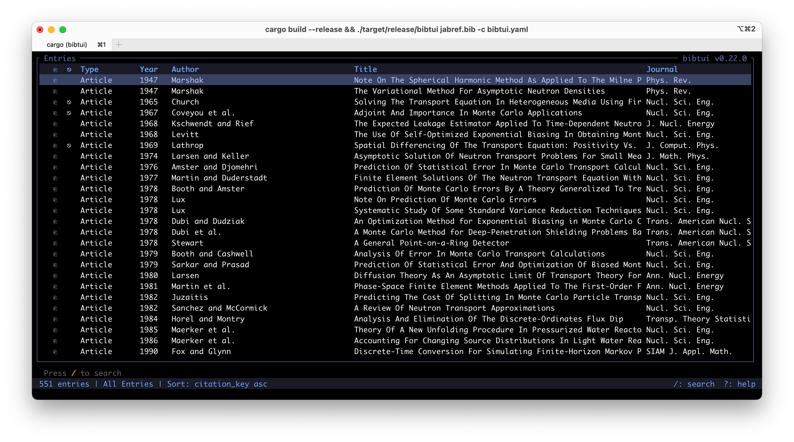

# bibtui

[](https://github.com/jkulesza/bibtui/actions/workflows/ci.yml)
[](https://codecov.io/gh/jkulesza/bibtui)

A terminal UI BibTeX manager written in Rust. Designed as a lightweight, keyboard-driven replacement for JabRef.



## Features

- Fast fuzzy search across all fields with field-specific syntax (`author:smith year:2020`)
- JabRef-compatible group tree (static and keyword groups)
- Byte-perfect BibTeX round-tripping — formatting is preserved for unmodified entries, including blank lines inside values, macros, and comments; in edited or rekeyed entries, unchanged fields keep their original form (`#` concatenation, `@String` references, quoted vs braced style); optional `field_order: alphabetical` sorts fields within required / optional / nonstandard subgroups on save
- Vim-style navigation throughout
- Entry CRUD: add, edit, duplicate, delete with undo (`u`); editing after undo correctly retains unsaved-change protection
- JabRef-compatible citation key patterns with three-level precedence (`.bib` metadata, YAML config, defaults)
- Per-library settings stored in the `.bib` file override the YAML config; JabRef-shared capabilities (key patterns, save order, save actions) use JabRef's own metadata keys, and everything else is kept as `bibtui.*` metadata that JabRef preserves
- Clipboard yank (`yy`) in configurable format: citation key, raw BibTeX, or formatted citation
- Per-entry status indicators: `●` unsaved change, `⎘` file attachment, `⎋` DOI/URL
- Open attached files (`o`) or DOI/URL links (`w`) with OS default applications
- Citation preview popup (`Space`) with DOI/URL link, formatted in IEEEtranN style
- LaTeX markup rendered to Unicode for display (`L` to toggle)
- Assigned groups shown in the entry detail header alongside the entry type
- ISO 4 journal abbreviation: the Journal column always shows the abbreviated form; a save action syncs `journal_full` and `journal_abbrev` companion fields
- Configurable columns, sort, theme, citekey templates, and **keybinding overrides** via YAML
- Export entries to **CSL-JSON** (Zotero/Pandoc compatible) or **RIS** via `:export-json` / `:export-ris`
- In-TUI settings editor (`S`) with live config import/export, `Tab`-completion path dialogs, and field group management
- Validate command (`v`) dry-runs all save actions and shows which fields would change, without modifying the file
- Context-sensitive help modal (`?`): entry-list view shows navigation, search, command-palette, and **Quality** (C / M / v) keys in dedicated sections; detail view shows field editing and vim modal editor keys
- `F` in the detail view syncs the attached filename to the current citation key on demand, with undo support; partial failures keep successful paths accurate, and forward/undo renames never overwrite an existing destination
- Scrollable filename-sync preview dialog confirms file renames before they are applied
- Import entries from a DOI, URL, or local PDF file (`I` or `:import <doi-or-url-or-path>`): queries Crossref for metadata, with extensible publisher-specific scrapers (ANS, Taylor & Francis); automatically downloads an open-access PDF via Unpaywall when available; extracts DOI from local PDFs and sets the file attachment directly; citation key is generated immediately from the configured template
- Import books by ISBN-10 or ISBN-13 (`I` or `:import <isbn>`): fetches metadata from OpenLibrary; accepts any common notation (bare digits, hyphens, spaces, mixed); stores ISBN-13 when available, falls back to ISBN-10
- Per-file attachment management in the detail view: each attached file appears as its own navigable row; `e`/`Enter` edits the path, `f` adds a new attachment, `d` removes an individual file
- URL fields preserve percent-encoding (e.g. `%20`) on save
- Leading/trailing whitespace is stripped from every field value on save (`{University of Texas }` → `{University of Texas}`); disable with `save_action_trim_whitespace: false`
- Duplicate citation keys are detected at load: later copies are renamed with a `_dupN` suffix (persisted on the next save) and a startup warning lists the affected keys
- `w` fetches DOI/URL from Crossref via metadata (title, author, year) when none is present, in both the entry list and detail view; only sets `url` when it is distinct from the DOI; when multiple links are available (DOI, URL, ISBN) a picker dialog is shown
- `w` opens an OpenLibrary search (`openlibrary.org/search?isbn=…`) for entries with an `isbn` field but no DOI or URL
- HTTPS imports explicitly use the native TLS connector and OS trust store on non-musl builds; musl builds use rustls with bundled webpki roots. Certificate and hostname verification remain enabled
- Import errors are shown in a full-screen popup so long messages (e.g. network errors) are never truncated; `yy` copies the error text to the clipboard

## Requirements

- Rust toolchain (1.88.0 or newer): https://rustup.rs

## Build

```sh
cargo build --release
```

The binary is placed at `target/release/bibtui`.

Optionally copy it to somewhere on your `$PATH`:

```sh
cp target/release/bibtui ~/.local/bin/
```

Pre-built binaries for Linux (static musl and RPM), macOS (Apple Silicon and Intel), and Windows are attached to each [GitHub release](https://github.com/jkulesza/bibtui/releases). macOS binaries are code-signed and notarized with an Apple Developer ID, so Gatekeeper will not block them.

**Linux RPM** (Fedora / RHEL / openSUSE):

```sh
sudo rpm -i bibtui-<version>-linux-x86_64.rpm
```

## Usage

```
bibtui [OPTIONS] [BIB_FILE]

Arguments:
  [BIB_FILE]  Path to .bib file

Options:
  -c, --config <CONFIG>  Path to config file
  -h, --help             Print help
  -V, --version          Print version
```

If no file is given on the command line, bibtui looks for `bib_file` in the config file. A path that does not exist yet opens a blank library and the file is created on first save.

```sh
bibtui references.bib
bibtui --config ~/dotfiles/bibtui.yaml references.bib
```

## Keyboard Reference

Key release events are ignored. Holding a key repeats navigation and text
entry/deletion only; repeats never complete multi-key commands (`dd`, `gg`, …) or
repeat deletions, confirmations, or custom bindings.

### Entry List (Normal mode)

| Key | Action |
|-----|--------|
| `j` / `↓` | Move down |
| `k` / `↑` | Move up |
| `gg` | Jump to top |
| `G` | Jump to bottom |
| `Ctrl-F` / `Ctrl-B` | Page down / up |
| `Enter` | Open entry detail (list focus) / select group (sidebar focus) |
| `a` | Add new entry |
| `dd` | Delete selected entry |
| `D` | Duplicate selected entry |
| `yy` | Yank to clipboard (see `general.yank_format`) |
| `/` | Start fuzzy search |
| `h` / `←` | Focus group sidebar (reveals it if hidden) |
| `l` / `→` | Focus entry list |
| `Tab` | Toggle group sidebar |
| `Space` | Citation preview popup (list focus) / select group (sidebar focus) |
| `o` | Open attached file(s) in OS default viewer |
| `w` | Open DOI / URL in default browser |
| `B` | Toggle case-protecting brace display |
| `L` | Toggle LaTeX rendering (accents, math, dashes) |
| `v` | Validate: dry-run save actions, show what would change |
| `I` | Import entry from DOI, URL, ISBN, or local PDF file |
| `S` | Open settings editor |
| `u` | Undo last change |
| `:` | Open command palette |
| `?` | Show full-screen help modal |
| `Esc` | Clear active search filter (if any); otherwise reset sort to configured default |

### Search mode

| Key | Action |
|-----|--------|
| Type | Append to search query |
| `Enter` | Confirm search / lock results |
| `Esc` | Clear search and exit |

Search syntax:
- Plain text — fuzzy match across all fields
- `field:query` — restrict to a specific field, e.g. `author:smith`, `year:2024`, `title:neural`
- Space-separated terms must all match, each with its own optional qualifier:
  `author:smith year:2020`
- `"double quotes"` match a contiguous phrase: `title:"neural methods"` (an unclosed
  quote takes the rest of the input, so typing works incrementally)
- Unknown qualifiers search custom fields; `key`/`citekey`/`citation_key` and
  `type`/`entrytype` are aliases; URLs and DOIs containing colons are literal text

Search combines with the selected group (both filters apply). In libraries of more
than 500 entries, searches run in the background: the search bar shows
`searching…` and the current results stay visible until the new ones arrive.

### Entry Detail view

The detail header shows the entry type and its currently assigned groups.

| Key | Action |
|-----|--------|
| `j` / `k` | Move field selection |
| `gg` | Jump to first field |
| `G` | Jump to last field |
| `Ctrl-F` / `Ctrl-B` | Page down / up |
| `e` / `i` / `Enter` | Edit selected field (vim-style: `i` enters insert mode) |
| `A` | Add new field |
| `f` | Add file attachment |
| `F` | Sync attached filename(s) to current citation key (undoable) |
| `d` | Delete selected field |
| `T` | Convert selected field to title case |
| `t` | Change entry type (e.g. Article → InProceedings; undoable) |
| `a` | Normalize person-name fields (`author`, `editor`, etc.) to "Last, First" form |
| `o` | Open attached file(s) in OS default viewer |
| `w` | Open DOI / URL in default browser; if none exists, fetches DOI from metadata via Crossref |
| `Tab` | Edit entry's group assignments |
| `c` | Regenerate citation key from template |
| `B` | Toggle case-protecting brace display |
| `L` | Toggle LaTeX rendering |
| `u` | Undo last change |
| `/` | Start incremental field search |
| `n` / `N` | Jump to next / previous search match |
| `Esc` | Clear active search (first press); close detail (second press) |

### Field editor (Editing mode)

The field editor uses vim-style modal editing. Opening a non-empty field starts in **Normal mode**; opening an empty field starts directly in **Insert mode**. The title bar shows `— INSERT` or `— REPLACE` when in those modes. Empty `title` / `booktitle` fields are pre-filled with `{}` and the cursor is placed inside the braces so case-protection is applied automatically.

#### Normal mode

| Key | Action |
|-----|--------|
| `i` | Enter Insert mode at cursor |
| `a` | Enter Insert mode after cursor |
| `A` | Enter Insert mode at end of line |
| `I` | Enter Insert mode at start of line |
| `R` | Enter Replace mode (overwrites characters; Backspace undoes one char at a time) |
| `h` / `←` | Move cursor left |
| `l` / `→` | Move cursor right |
| `0` / `Home` | Jump to start |
| `$` / `End` | Jump to end |
| `w` / `W` | Move to start of next word / WORD |
| `b` / `B` | Move to start of current/previous word / WORD |
| `e` / `E` | Move to end of current/next word / WORD |
| `f{c}` | Find next occurrence of character `c` (cursor lands on `c`) |
| `F{c}` | Find previous occurrence of character `c` (cursor lands on `c`) |
| `t{c}` | Move cursor to char just before next occurrence of `c` |
| `T{c}` | Move cursor to char just after previous occurrence of `c` |
| `j` / `↓` | Save edit and move to next field |
| `k` / `↑` | Save edit and move to previous field |
| `x` | Delete character under cursor |
| `X` | Delete character before cursor |
| `dw` | Delete to start of next word |
| `dt{c}` | Delete from cursor to (not including) next `c` |
| `df{c}` | Delete from cursor through (including) next `c` |
| `dT{c}` | Delete from (not including) previous `c` back to cursor |
| `dF{c}` | Delete from (including) previous `c` back to cursor |
| `D` | Delete to end of line |
| `C` | Change to end of line (delete + enter Insert mode) |
| `s` | Substitute character (delete + enter Insert mode) |
| `S` | Substitute entire field (clear + enter Insert mode) |
| `r{c}` | Replace character under cursor with `c` |
| `~` | Toggle case of character under cursor |
| `p` | Put (paste) from unnamed register after cursor |
| `yy` | Yank entire field value to unnamed register and system clipboard |
| `u` | Undo last change |
| `Enter` | Confirm edit |
| `Esc` | Cancel edit |

#### Insert mode

| Key | Action |
|-----|--------|
| Type | Insert character |
| `←` / `→` | Move cursor |
| `Ctrl-A` / `Home` | Jump to start |
| `Ctrl-E` / `End` | Jump to end |
| `Backspace` / `Delete` | Delete character |
| `Ctrl-W` | Delete word before cursor |
| `Ctrl-U` | Delete to start of line |
| `Tab` / `Shift-Tab` | Cycle forward / backward through completions |
| `Enter` | Confirm edit |
| `Esc` | Return to Normal mode |

Operations that delete text (`x`, `dw`, `dt{c}`, `df{c}`, `dT{c}`, `dF{c}`, `D`, `s`, `S`, `Ctrl-W`, `Ctrl-U`) save the deleted text to the unnamed register so it can be restored with `p`. Entering Insert mode via `i`/`a`/`A`/`I` snapshots the field value for undo with `u`. In Replace mode (`R`) each overwritten character is individually reversible with `Backspace`.

Long values scroll horizontally; `<` and `>` at the edges indicate hidden text.  The cursor is kept near the visual midpoint: it moves freely between the nearest edge and the centre, then the text scrolls while the cursor stays fixed at the centre.

**Month field selector:** editing a `month` field shows a visual 2×6 grid of the
standard BibTeX abbreviations (`jan`–`dec`). Use `←`/`→` to step one month,
`↑`/`↓` to jump between rows, or type a prefix (with ghost-text autocomplete) and
press `Tab` to cycle through matches. Any recognized form (`january`, `1`, `Jan`, etc.)
is normalized to the three-letter abbreviation on save.

Path dialogs (settings export/import, import entry, and export dialogs) support `Tab`
completion: the first press fills the longest common prefix of all matches; subsequent
presses cycle through candidates. Leading `~` is expanded to the home directory.

### Settings editor (`S`)

Opens a full-screen view of all configuration options. Changes apply immediately to the running session.

| Key | Action |
|-----|--------|
| `j` / `k` | Navigate settings |
| `g` / `G` | Jump to top / bottom |
| `Ctrl-F` / `Ctrl-B` | Page down / up |
| `Enter` / `Space` | Toggle boolean setting |
| `e` | Edit string setting / edit fields of selected field group |
| `r` | Rename selected field group |
| `a` | Add new field group |
| `x` | Delete selected field group |
| `E` | Export the YAML layer of the config to a YAML file (path dialog with `Tab` completion); settings stored in the library are not included |
| `B` | Write settings into the library's `.bib` file, after previewing the exact changes (see [Library settings](#library-settings-stored-in-the-bib)) |
| `I` | Import config from a YAML file (path dialog with `Tab` completion); library settings still take precedence |
| `Esc` | Close settings |

Settings marked with `●` differ from their default value; settings marked with
`◆` come from the library's `.bib` file and override the YAML config. Changing a
`◆` setting updates the library (an undoable edit, saved with `:w`); changing
any other setting changes the session's YAML layer, which `E` exports.

### Command palette

Open with `:` from the entry list.

| Command | Description |
|---------|-------------|
| `:w` / `:write` / `:save` | Save the file |
| `:w!` / `:write!` | Save even if the file changed outside bibtui (external version kept in `.bib.bak`) |
| `:wq` | Save and quit |
| `:wq!` | Force-save and quit |
| `:q` | Quit (confirmation dialog if unsaved changes) |
| `:q!` | Force quit without saving |
| `:sort <field>` | Sort by field (repeat to toggle direction) |
| `:sort none` | Clear sort and restore file order |
| `:sort` | Toggle sort direction |
| `:group <name>` | Filter to a named group |
| `:search <query>` | Apply a search query |
| `:import <doi-or-url-or-path>` | Import entry from DOI, URL, or local PDF file |
| `:export-json [path]` | Export all entries as CSL-JSON (prompts for path if omitted) |
| `:export-ris [path]` | Export all entries as RIS (prompts for path if omitted) |
| `:settings-export bib` | Write settings into the library's `.bib` file (same as `B` in Settings) |
| `:settings-export yaml [path]` | Export the YAML layer of the config (prompts for path if omitted) |
| `:settings-clear-bib` | Remove all bibtui settings from the library; JabRef's own keys are kept (undoable) |

Example: `:sort year`, `:sort author`, `:sort title`, `:sort citation_key`, `:sort none`

`year`, `volume`, `number`, and `pages` (leading page number) sort numerically; all
other fields sort as text, even when some values contain only digits.

Sorting keeps an active group filter in place — `:sort` re-applies the filter to the
newly sorted list instead of falling back to all entries. If the sort field isn't one
of the configured columns, its values are shown in a temporary column on the right so
the sort is visually confirmable; the column disappears again once the sort changes to
a visible field or is cleared.

#### Saving

When `save.sync_filenames` is enabled, saving with `:w` or `:wq` shows a scrollable
preview of any file renames that will be performed, with `[y]es` / `[n]o` to proceed
or cancel. The preview is built from the final normalized fields and generated keys,
and confirming executes exactly that plan. Attachments that are missing from disk or
are remote links (`https://…`) are never renamed; the save completes and the status
line lists them. Case-only renames (`smith2020.pdf` → `Smith2020.pdf`) work on
case-insensitive filesystems. A rename never overwrites an existing file, and
shared attachments or occupied destinations are reported before any file is moved.
If saving fails, completed attachment moves are reversed.

A failed save keeps the application open and the library marked unsaved, including
with `:wq`; correct the error and retry. Saves write an exclusive temporary file in
the destination directory, keep the existing file's permissions (new files get
normal permissions for your umask), and follow symlinks without replacing the link.

If the bibliography changed outside bibtui since it was loaded or last saved, `:w`
is refused and neither the file nor its backup is touched. Reload the file, or use
`:w!` to overwrite it; the external version is first copied to `.bib.bak` even when
`backup_on_save` is off. This is a check, not a lock against another program writing
at the same moment.

Undo works across saves: restored entries and citation keys are written on the next
save. Citation keys regenerated during save form a single undo step, and key changes
also update matching `crossref` fields (exact, case-sensitive matches) in that step.
Documents outside the library that cite old keys must be updated separately; disable
`save_action_regenerate_citekeys` to keep existing keys on save.

### Group tree

| Key | Action |
|-----|--------|
| `j` / `k` | Move selection |
| `Enter` / `Space` | Apply selected group filter |
| `h` / `l` | Switch focus between groups and entry list |

The group sidebar can be hidden with `Tab` and revealed again with `Tab` or `h` / `←`.
The `display.show_groups` config option controls whether it is visible on startup.
Groups are tracked by their position in the tree, so two groups with the same name
in different subtrees filter independently.

## Configuration

bibtui looks for a config file in this order:

1. Path given with `--config`
2. `./bibtui.yaml` or `./bibtui.yml` (next to the working directory)
3. `$XDG_CONFIG_HOME/bibtui/config.yaml` (typically `~/.config/bibtui/config.yaml`)

If no file is found, built-in defaults are used.

Copy the annotated example to get started:

```sh
cp bibtui.yaml.example ~/.config/bibtui/config.yaml
```

### Library settings (stored in the `.bib`)

A library can carry its own settings, so it behaves the same on every machine
and for every collaborator. Precedence is: built-in defaults < YAML config <
library. Settings are stored as JabRef metadata comments, so JabRef keeps them
when it saves the file:

| Setting | Stored as |
|---|---|
| Citation-key templates | JabRef's `keypattern_<type>` (also used by JabRef) |
| Entry order on save (`save.entry_sort_order`) | JabRef's `saveOrderConfig` |
| Save actions JabRef also has: Unicode→LaTeX, escape `_`/`&`, LaTeX cleanup, URL cleanup, ordinals, date/month/page/name normalization | JabRef's `saveActions` (JabRef applies them too) |
| Everything else | `@Comment{jabref-meta: bibtui.<setting>:<value>;}` |

Press `B` in Settings (or run `:settings-export bib`) to write settings into the
library. A preview lists every metadata line that will be added (`+`), changed
(`~`), or removed (`-`); nothing changes until you confirm, and the result is an
ordinary undoable edit saved with `:w`. bibtui writes the settings that differ
from its built-in defaults, plus any the library already stores.
`:settings-clear-bib` removes bibtui's own keys and leaves JabRef's alone.

Notes:

- A library that already has JabRef `saveActions` or `saveOrderConfig`
  (for example JabRef's defaults, which only normalize dates, months, and
  pages) overrides the corresponding YAML settings. bibtui says so at startup;
  turn an action back on in Settings to rewrite `saveActions` for both programs.
- If JabRef's `saveActions` use formatters bibtui does not have, or its
  `saveOrderConfig` sorts by other fields, bibtui reads what it can and never
  rewrites them.
- `general.bib_file` cannot be stored in a library.
- `bibtui.*` values are one-line JSON. A bare word (`alphabetical`) is read as a
  string; invalid values are reported at startup and ignored.

### Key config options

```yaml
general:
  bib_file: ~/documents/references.bib   # default file when none given on CLI
  backup_on_save: true                    # write .bib.bak before every save
  yank_format: prompt                     # citation_key | bibtex | formatted | prompt
                                          #   citation_key — bare key (e.g. Smith2020)
                                          #   bibtex       — raw @Article{...} block
                                          #   formatted    — IEEEtranN citation string
                                          #   prompt       — picker dialog each time

display:
  show_groups: true                       # show group sidebar on startup
  group_sidebar_width: 30
  show_braces: false                      # show/hide case-protecting {braces}; toggle with B
  render_latex: true                      # render LaTeX → Unicode for display; toggle with L
  abbreviate_authors: true                # abbreviate author lists in entry list
  journal_field_content: full             # what the journal field holds after the
                                          # abbreviate_journal save action:
                                          #   full        — full journal name
                                          #   abbreviated — ISO 4 abbreviation
                                          # (the Journal column always shows the
                                          #  abbreviated form regardless of this setting)
  default_sort:
    field: citation_key
    ascending: true

save:
  align_fields: true                      # align field values to a column on save
  field_order: jabref                     # jabref (default) | alphabetical
                                          # jabref preserves original field order;
                                          # alphabetical sorts within required / optional /
                                          # nonstandard subgroups on every save
  sync_filenames: false                   # rename attached files to match citation key on save
                                          # (preview dialog shown before applying)
  save_action_trim_whitespace: true       # strip leading/trailing whitespace from every field
                                          # value ({University of Texas } → {University of Texas})
  save_action_abbreviate_journal: false   # populate journal_abbrev (ISO 4) and journal_full
                                          # companion fields on save; rewrite journal per
                                          # journal_field_content (display/settings)

titlecase:
  ignore_words: [MCNP, OpenMC]           # words kept verbatim by the T title-case command

theme:
  selected_bg: "#3b4261"
  selected_fg: "#c0caf5"
  header_bg:   "#1a1b26"
  header_fg:   "#7aa2f7"
  search_match: "#ff9e64"
  border_color: "#565f89"
```

```yaml
# Custom field groups in the detail view (fields pulled out of the "Other" section)
field_groups:
  - name: Identifiers
    fields: [isbn, issn, lccn, eprint, archiveprefix, primaryclass]
```

```yaml
# Override or add keybindings on a per-mode basis
keybindings:
  normal:
    "ctrl-n": "AddEntry"      # add entry with Ctrl-N
    "ctrl-d": "DeleteEntry"   # delete with Ctrl-D
    "J":      "ExportJson"    # export CSL-JSON
    "R":      "ExportRis"     # export RIS
  detail:
    "ctrl-r": "RegenCitekey"  # regenerate citekey
```

Supported modes: `normal`, `detail`, `search`, `editing`, `settings`, `citation_preview`, `dialog`, `command`.
Use `"None"` as the action to intentionally unbind a key.

See `bibtui.yaml.example` for all options including columns, citekey templates, save normalization, and a full keybinding reference.

## Import

Press `I` from the entry list (or run `:import` from the command palette) to import an entry. The input accepts:

- **Bare DOI** — `10.1080/00295639.2025.2483123`
- **DOI URL** — `https://doi.org/10.1080/...` or `http://dx.doi.org/10.1080/...`
- **Publisher URL** — e.g. `https://www.tandfonline.com/doi/abs/10.1080/...` or `https://www.ans.org/pubs/...`
- **Local PDF file** — `/path/to/paper.pdf` or a relative path; `Tab` completes filesystem paths

The import pipeline (in priority order):

1. **PdfFetcher** — for local `.pdf` files: scans the first 200 KB and last 50 KB of raw bytes for a DOI (labeled patterns like `doi:`, `doi.org/`, XMP `prism:doi`, and bare `10.XXXX/...` patterns), then looks up the DOI via Crossref. The PDF path is set as the file attachment directly — no download needed.
2. **AnsFetcher** — for `ans.org` article URLs: scrapes the page for metadata and PDF URL candidates.
3. **TandFOnlineFetcher** — for `tandfonline.com` URLs: extracts the DOI from the URL path or page metadata.
4. **CrossrefFetcher** — general fallback for any bare DOI or `doi.org` URL.

After metadata is fetched, the pipeline:
- Corrects the `publisher` field when Crossref reports a distributor instead of the society publisher (e.g. ANS journals distributed by Taylor & Francis are corrected to "American Nuclear Society", identified by DOI prefix `10.13182/`, ISSN, or journal name).
- Queries [Unpaywall](https://unpaywall.org/) for a legal open-access PDF URL and, if found, prepends it to the download candidate list.

PDF candidates are tried in order (Unpaywall OA → publisher PDF → ANS direct → T&F PDF) until one succeeds. The `file` field is written as a relative path from the JabRef `fileDirectory` when that metadata is present, with `:` and `;` escaped as JabRef expects (including Windows drive letters).

Network limits: metadata requests have a 5-second connect, 10-second read, and
30-second total timeout, the whole metadata phase of an import is limited to 90
seconds, and metadata responses are capped at 4 MiB. The optional Unpaywall lookup
has 5 seconds and is skipped for local PDFs. PDF downloads are not subject to those
budgets: they stop only if the connection stalls for 10 seconds, exceed 10 minutes,
or exceed `import.max_pdf_size_mb` (default 100).

Downloads are streamed to a temporary file, checked for the `%PDF` signature, and
then given their final name. Re-importing a DOI reuses an identical earlier download;
if a different file already has that name, the new one is saved as `<doi>_2.pdf`
(and so on), so existing files are never overwritten. A failed download keeps the
imported metadata and reports the error. For local PDFs, DOI detection reads only the
first 200 KB and last 50 KB of the file.

## Running Tests

```sh
cargo test
```

Run `cargo test --locked` for the complete suite. CI runs native tests on Linux,
macOS, and Windows and checks the minimum compiler, Rust 1.88.0. Formatting and
strict Clippy use Rust 1.93.1. Coverage uses the same fixed compiler and
cargo-llvm-cov 0.8.4; `scripts/check_coverage.py` checks the checked-in overall and
application-module floors in `coverage-baseline.json`. Baseline changes require an
explicit edit with an explanation. `cargo llvm-cov report --summary-only` displays
an existing report without rerunning tests. See the
[review implementation report](review/IMPLEMENTATION.md) for all 19 completed
items, measured coverage, before/after performance, reproducible probes, and
remaining platform-validation limits.

The suite drives real keyboard and paste events through edit/save/undo workflows,
uses temporary directories for config and library fixtures, and makes no requests
to public services. Format with `cargo fmt --all` (CI runs
`cargo fmt --all -- --check`). Repository-wide formatting commits are listed in
`.git-blame-ignore-revs`; enable it locally with
`git config blame.ignoreRevsFile .git-blame-ignore-revs`.

Coverage analysis runs automatically in CI via `cargo-llvm-cov`. To run locally:

```sh
cargo llvm-cov --workspace --summary-only
```

## Changelog

See [CHANGELOG.md](CHANGELOG.md) for the full release history.
